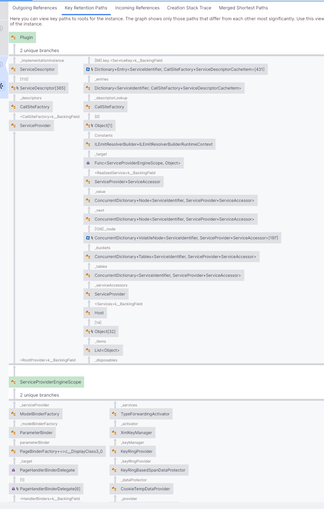
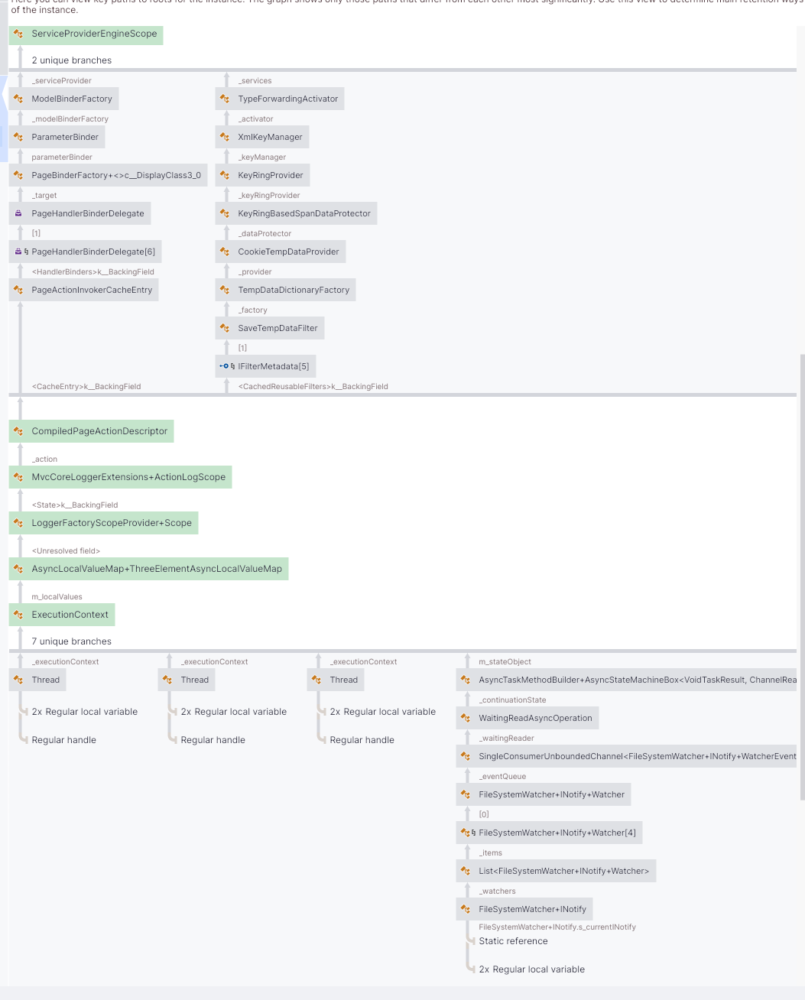

> [!NOTE]
> Polish only, use some ChatGPT, Claude_CopilotProGemini2027KimiK67, Редхат Линукс Эксплоит GCC от Редхат на квантово-физико-математическом уровне Systemd СССР
> To translate to your language.
> Or just ignore my dump of insanity

# Layers of Insanity - ASP.NET Core Plugin System
Nadszedł w końcu czas, kiedy postanowiłem zrobić system pluginów w ASP.NET Core.
Naturalnie, chciałem żeby był jak najbardziej cool, a więc ładowanie i przeładowywanie
pluginów *at runtime*.

Szybki Google Search i trafiam na tutorial od Microsoftu jak robić pluginy w .NET[^1]
oraz jak je odładować.[^2] Wybornie!

Na początek stworzyłem sobie projekt `ScuroGuardiano.Net.Abstractions`, gdzie umieściłem parę przydatnych klas,
w tym klasę bazową dla pluginów - `AbstractPlugin` (na chwilę obecną nie ma za wiele funcjonalności)
```cs
public abstract class AbstractPlugin
{
    public abstract PluginIdentity Identity { get; }
    public virtual IEnumerable<PluginDependency> Dependencies { get; } = [];

    public virtual Task RegisterServicesAsync(IServiceCollection services)
    {
        return Task.CompletedTask;
    }

    public virtual Task ConfigureAsync(IServiceCollection services, IConfiguration configuration)
    {
        return Task.CompletedTask;
    }

    public virtual IEnumerable<MenuEntry> MenuEntries { get; } = [];
}
```

Do tego korzystam z faktu, że ASP.NET Core sam grzecznie załaduje wszystkie *Razor Pages*
z załadowanych *Assembly*, aczkolwiek stwierdziłem, że wolę być bardziej explicit, więc
ładuję je jawnie:

```cs
var mvcBuilder = builder.Services.AddRazorPages();
foreach (var plugin in _pluginManager.Plugins)
{
    Console.WriteLine($"Registering plugin { plugin.Identity.Name }");
    mvcBuilder.AddApplicationPart(plugin.GetType().Assembly);
}
```

## Layer 0 - Nieświadomy błędu
Domyślnie nie ma łatwego sposobu, żeby zmodyfikować już utworzoną aplikację oraz 
już utworzony `IServiceProvider`. Pojawił się w takim razie w mojej głowie kompromis:

> *Mogę zrobić przecież soft restart - **zatrzymać i zdispose-ować `WebApplication`**, a*
> *następnie **zbudować ją na nowo.***

A więc tak zrobiłem, tworząc klasę nadającą świadomość mojej aplikacji: `PluginAwareApplication`.
Wziałem *stary* sposób na tworzenie aplikacji, klasa z metodami `Configure` oraz `Startup` czy coś takiego.

Startup na koniec robił po prostu:
```cs
await app.RunAsync();
```
Co, przynajmniej według ChataGPT, okaże się błędem w tym zastosowaniu.

W każdym razie dodałem metodę do miękkiego wyłączenia appki:
```cs
public async Task SoftShutdown()
{
    _logger.LogInformation("Wyłączam WebApplication...");

    var application = Interlocked.Exchange(ref _webApplication, null);

    if (application is null)
    {
        return;
    }

    await application.StopAsync(TimeSpan.FromSeconds(30));
    await application.DisposeAsync();

    _logger.LogInformation("WebApplication wyłączona.");
}
```

oraz do zbudowania i startu:
```cs
public async Task CreateAndStart(string[] args)
{
    if (IsActive)
    {
        throw new InvalidOperationException("Application has already been started");
    }

    _logger.LogInformation("Startuję aplikację...");

    await Configure(args);
    await Startup();
}
```

I przyszedł czas na test unloadu - czy nie będzie MemoryLeaka?  
Otóż... kurwa jego mać

## Layer 1 - `AssemblyLoadContext` Unload in ASP.NET Core[^2]
Plan na test prosty, dodajemy akcję w Razor Page (albo kontrolerze, whatever, akurat to miałem pod ręką)
i odładowujemy wszystkie pluginy, a następnie sprawdzamy na `WeakReference` czy ciągle żyje, metodką od
samego Microsoftu[^2]:
```cs
for (int i = 0; weakAcl.IsAlive && i < 10; i++)
{
    GC.Collect();
    GC.WaitForPendingFinalizers();
}
```

Otóż, nie zgadniecie. Nie działało!

Zaczęła się więc moja podróż w głąb CLR wraz z najróżniejszymi chatbotami,
aby znaleźć odpowiedź na jedno ważne pytanie:

> ***Co do kurwy trzyma referencje do typów z Assembly załadowanej przez ALC?!***

Po długiej konwersacji z Claude[^3], zabawy narzędziami jak *dotMemory* oraz *dotnet-dump*,
aby znaleźć co trzyma referencje. (Swoją drogą *dotnet-dump* jest znacznie przydatniejszy przy pracy z chatbotami).

I oto co ukazało się moim oczom w *dotMemory*:



Już tłumaczę co tu widzimy, mianowicie to jest cały asynchroniczny stos zapytania MVC czy raczej
*flow* w *Execution Context* zapytania. Otóż unload pluginów i soft restart aplikacji robiony był
w następujący sposób:

```cs
public IActionResult OnPostReloadPlugins([FromServices] PluginManager pluginManager)
{
    Task.Run(pluginManager.UnloadAllPlugins);
    return Content(/* nieistotne */);
}
```

Myślałem, że robiąc te `Task.Run` robię *Fire and Forget*, ale jak się okazuje nie.
***ExecutionContext***, a wraz z nim wszelkie ***AsyncLocal***, ***ThreadLocal***
i inne cuda. Jest dosyć stary artykuł od *Stephena Touba*, który wyjaśnia jak to działało w .NET Framework.[^4]

Niespodziewanka, nie wiedziałem o istnieniu tego! W każdym razie, według ChataGPT działo się coś takiego:
1. Flow leci od Requesta przez Taska, przez `SoftShutdown`, metody w moim `PluginManager` aż do `CreateAndStart`.
2. Z `CreateAndStart` kończy na `Startup`
3. Gdzie kończy blokując asynchronicznie na `await app.RunAsync()`

Więc referencja była trzymana ciągle przez starą `WebApplication`, mimo że już był walnięty na niej `DisposeAsync`.

ChatGPT kazał mi zmienić `app.RunAsync()` na `app.StartAsync()`, co zrobiłem, ale nie pomogło.

Dodatkowym rozwiązaniem, jakie musiałem wdrożyć, to `ExecutionContext.SupressFlow()`. Wtedy `ExecutionContext` nie przelatuje
dalej i referencje z całego flow requesta nie są trzymane:
```cs
public IActionResult OnPostReloadPlugins([FromServices] PluginManager pluginManager)
{
    using (ExecutionContext.SuppressFlow())
    {
        Task.Run(pluginManager.UnloadAllPlugins);
    }
    return Content(/* nieistotne */);
}
```

Serio, zawsze muszę wpaść na pomysł, powodujący problemy, na które rozwiązaniem jest jakaś niszowa, obskurna metoda,
w mechanizmie, o którym mało kto musi w ogóle wiedzieć i się nim przejmować. Na serio, [*my worst enemy has always been myself*](https://youtu.be/HggJJottXZE).

## Layer 2 - `private static readonly ConcurrentDictionary<Type, PropertyHelper[]> PropertiesCache`
Niestety, połowiczny sukses osiągnąłem, ale dalej `AssemblyLoadContext` nie był usuwany.
Jak się okazało, Microsoft ma sobie klaskę, na której ma ***STATYCZNE*** `ConcurrentDictionary` do cache'owania propertek z Reflection.
```cs
namespace Microsoft.Extensions.Internal;

internal sealed class PropertyHelper
{
    private static readonly ConcurrentDictionary<Type, PropertyHelper[]> PropertiesCache = new();
    private static readonly ConcurrentDictionary<Type, PropertyHelper[]> VisiblePropertiesCache = new();
    ...
}
```

Ludzie od Rusta mieli rację - globalne zmienne to *GC*[Root of All Evil](https://youtu.be/px-VOxSaOAo).

Rozwiązanie jest brzydkie i nieakceptowalne, ale zaszedłem już za daleko, więc musiałem zastosować to co Claude wypluł:
```cs
[MethodImpl(MethodImplOptions.NoInlining)] // Moja desperacka próba pozbycia się referencji
private void CollectAssemblyLoadContext(WeakReference weakAcl)
{

    PurgeStaticTypeCache("Microsoft.Extensions.Internal.PropertyHelper", "PropertiesCache",
        "VisiblePropertiesCache");

    for (int i = 0; weakAcl.IsAlive && i < 10; i++)
    {
        GC.Collect();
        GC.WaitForPendingFinalizers();
    }

    if (weakAcl.IsAlive)
    {
        _logger.LogError(
            "Coś trzyma referencję do ALC, uniemożliwiając lekkie przeładowanie. Wymagany jest restart procesu.");
    }
    else
    {
        _logger.LogInformation("ALC została odładowana.");
    }
}

private void PurgeStaticTypeCache(string typeFullName, params string[] fieldNames)
{
    foreach (var asm in AppDomain.CurrentDomain.GetAssemblies())
    {
        var type = asm.GetType(typeFullName);
        if (type is null) continue;

        foreach (var fieldName in fieldNames)
        {
            try
            {
                var field = type.GetField(fieldName, BindingFlags.NonPublic | BindingFlags.Static);
                if (field?.GetValue(null) is System.Collections.IDictionary dict)
                    dict.Clear();
            }
            catch (Exception ex)
            {
                _logger.LogWarning(ex, "Nie udało się wyczyścić {Field} z {Type} w {Assembly}",
                    fieldName, typeFullName, asm.FullName);
            }
        }
    }
}
```

Niestety **MIMO TO** dalej `if (weakAcl.IsAlive)` zwracało true. Ale po wyjściu z metody,
`AssemblyLoadContext` wreszcie zniknęło z dotMemory. Sukces!

Rozwiązanie oparte o czyszczenie cache'a wnętrzności frameworka poprzez Reflection nie jest do
końca akceptowalne - w końcu klasy `internal` mogą się zmienić. Ale to mój toy projekt, więc
*all means necessary*.

Szczerze to mogę to olać i zaakceptować ten minimalny wyciek pamięci przy reloadzie,
liczony pewnie w skali 1-2kB. Albo olać całkowicie miękki restart i zrestartować
proces przez `execve`.

Cały ten paskudny kod znajduje się w [tym commicie](https://github.com/ScuroGuardiano/scuroguardiano.net/tree/40ad22f116a99066c79ec88731eac8634c16f6b3)[^7]

## Layer 3? - zobaczmy
Następny poziom to będzie łamanie wnętrzności `DependencyInjection`, aby dynamicznie, bez restartu aplikacji, nawet miękkiego,
ładować i reloadować serwisy! Ale będzie zabawa.

A jak mi się nie będzie chciało już bawić, no to[^8],[^9]
```cs
[DoesNotReturn]
public static void SacrificialArson(string command, ReadOnlySpan<string> args)
{
    string[] argv = [command, ..args, null!];
    string?[] envp =
        [.. Environment.GetEnvironmentVariables().Cast<DictionaryEntry>().Select(e => $"{e.Key}={e.Value}"), null];

    NativeInterop.Execve(command, argv, envp);

    throw new Exception($"execve() failed: {Marshal.GetLastWin32Error()}");
}
```

# Odnośniki
[^1]: [Create a .NET Core application with plugins](https://learn.microsoft.com/en-us/dotnet/core/tutorials/creating-app-with-plugin-support)
[^2]: [How to use and debug assembly unloadability in .NET](https://learn.microsoft.com/en-us/dotnet/standard/assembly/unloadability)
[^3]: [Mój beznadziejny chat z Claude](https://claude.ai/share/0bd7c47b-0231-4155-aacb-6ea791afaedb)
[^4]: [ExecutionContext vs SynchronizationContext](https://devblogs.microsoft.com/dotnet/executioncontext-vs-synchronizationcontext/)
[^5]: [My worst enemy has always been myself](https://youtu.be/HggJJottXZE)
[^6]: [Root of All Evil](https://youtu.be/px-VOxSaOAo)
[^7]: [Clusterfuck commit](https://github.com/ScuroGuardiano/scuroguardiano.net/tree/40ad22f116a99066c79ec88731eac8634c16f6b3)
[^8]: [Escape of the Phoenix](https://youtu.be/CfYPUmKB48w)
[^9]: [execve(2)](https://man7.org/linux/man-pages/man2/execve.2.html)
